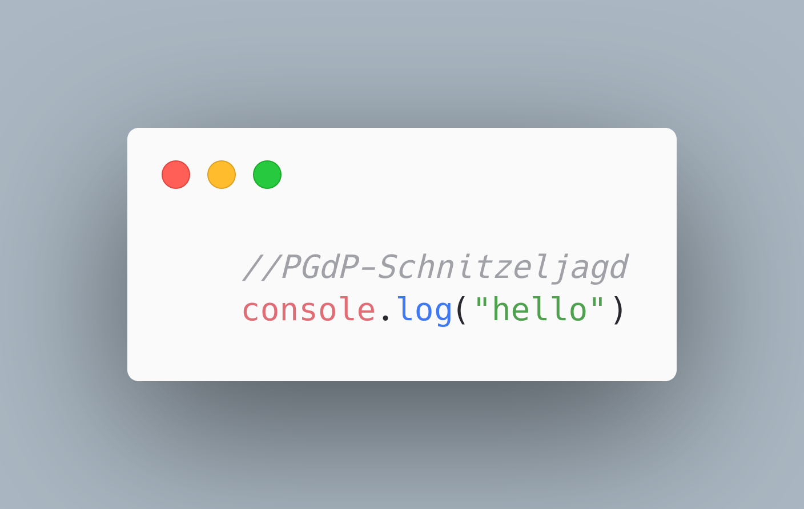

# F02A02: 🈶 Polylingual Pingu

_**Schnitzeljagd** durch das MI inklusive, siehe Teil 2_

> Diese Aufgabe ist Teil der freiwilligen inoffiziellen Zusatzaufgaben von Eric Jacob und Jonas Wende, erstellt im WS
> 23/24 für *IN0002: Grundlagenpraktikum Programmierung*.
> Weder sind sie durch die ÜL überprüft, noch unbedingt vollständig richtig.
> Fehler gerne melden: https://github.com/cod-eric/pgdp-jacer/issues/new

> 🎄 *Advent, Advent, ein Server brennt*… oder so. Vorweihnachtlich gibt es jeden Adventssonntag eine freiwillige
> inoffizielle Zusatzaufgabe, die über den Inhalt von PGdP hinausgehen und euch einige Programmierkonzepte zeigen
> sollen,
> die ihr so in PGdP nicht lernt.

[TOC]

## 🎯 Lernziele

In dieser Aufgabe lernt ein paar Besonderheiten zweier weiterer Sprachen neben Java kennen - und, dass ihr die meisten
Programmiersprachen mit eurem Java-Wissen verstehen könnt, auch wenn ihr noch nie zuvor in diesen programmiert habt.

## 📜 Backstory

Zur vorweihnachtlichen Tradition der Pinguine gehört seit eh und je der alljährliche Besuch im "Museum für Alles" in
Cod-City. Heute, am 2. Adventssonntag, ist es wieder soweit - nach dem gemeinsamen Mittagessen, für welches Pingu-Opa
Max seinen
berühmten [Lachs mit Spekulatiuskruste](https://www.essen-und-trinken.de/rezepte/59961-rzpt-lachsfilet-mit-spekulatiuskruste)
gekocht hat, ging es los ins Museum. In jeder Abteilung fallen den Babypinguinen neben all den antiken Statuen und
Zeichnungen besonders die überlieferten Schriftstücke auf, welche in Vitrinen an der Wand hängen. Trotz deren Alter von
teils mehreren Jahrhunderten ist die Schrift darauf noch gut erhalten - nur schade, dass die Pinguine die Schriftzeichen
nicht entziffern können… Kannst du ihnen helfen?

## 📝 Aufgabenbeschreibung

Ziel dieser Aufgabe ist es, die Ähnlichkeit und Unterschiede zwischen verschiedenen Programmiersprachen zu sehen, und
auch die verschiedenen Auffassungen von Logik.
In Teilaufgabe 2 wird das auf spaßige Art mit einer Tour durch das MI verbunden - einer JavaScript-Schnitzeljagd!

## Teil 1: 🐍 Abteilung für Würgeschlangen - Python

Neben den ganzen imposanten Terrarien hängt an der Wand hinter einer Glasscheibe folgendes Papyrus der alten
Pharaouinen:

```py
###########
# Imports #
###########

# ignore the imports, they are not that relevant for understanding the Python language right now
from __future__ import annotations
from typing import *

import random as rnd


#######################
# Classes declaration #
#######################

class Snake:
    """
    This class represents a Snake with:
    - name
    - genus
    - mother
    - father
    - date born
    """

    snake_genera = ["Zwergpython", "Baumpython", "Schwarzkopfpython", "Wasserpython", "Raupenpython", "Netzpython"]

    # a Snake constructor which requires a name, genus, parents tuple and birthday
    def __init__(self, name: str, genus: str, parents: Tuple[Union[Snake, None], Union[Snake, None]],
                 birthday: int) -> None:
        self.name = name
        if genus not in self.snake_genera:
            print("This looks like a weird mutation...")
            self.genus = self.snake_genera[0]
        else:
            self.genus = genus
        self.mother, self.father = parents
        self.birthday = birthday

    # lets the snake make a "hiss" sound on the console
    def hiss(self) -> None:
        print("💤 " + self.name + " hisses!")

    # lets the snake slither around
    def slither(self) -> None:
        print("🐍", self.name, "slithers!")

    # breeds this egg with another Snake and returns a new Egg
    def breed(self, other_snake: Snake) -> Egg:
        return Egg(rnd.choice(self.snake_genera), (self, other_snake))


class Egg:
    """
    This class represents a (Snake) Egg with:
    - information about the days until it hatches
    - genus
    - mother
    - father
    """

    next_name_index = 0
    next_snake_names = ["Sssusan", "Zzzoe", "Sssteven", "Franc-hiss"]

    # an Egg constructor requiring a genus and parents tuple
    def __init__(self, genus: str, parents: Tuple[Snake, Snake]) -> None:
        self.days_until_hatch = 5
        self.genus = genus
        self.mother, self.father = parents

    # a method that slowly hatches the egg when incubated and always returns the "current entity",
    # i.e. either the yet-to-hatch Egg or a Snake once hatched
    def incubate(self, current_day: int) -> Union[Egg, Snake]:
        if rnd.randrange(2) == 0:
            self.days_until_hatch -= 1
            print("🥚 The egg cracked a little. It will hatch soon!")
        if self.days_until_hatch <= 0:
            snake_name = Egg.next_snake_names[Egg.next_name_index]
            Egg.next_name_index += 1
            return Snake(
                snake_name,
                self.genus,
                (self.mother, self.father),
                current_day
            )
        else:
            return self


##################
# Code procedure #
##################

# set up the terrarium
terrarium = {
    "snakes": [],
    "eggs": []
}

# two initial snakes - Adam and Eve
adam = Snake("Adam", "Zwergpython", (None, None), 0)
eve = Snake("Eve", "Wasserpython", (None, None), 0)
terrarium["snakes"].append(adam)
terrarium["snakes"].append(eve)
print(adam.name + " and " + eve.name + " moved into the terrarium.")

# let Adam and Eve lay 3 eggs
for i in range(3):
    terrarium["eggs"].append(adam.breed(eve))
    print("🪺 An egg was laid!")

# now incubate the eggs until all the baby snakes hatched
print("The eggs will now be incubated")
day = 0
while not len(terrarium["eggs"]) == 0:
    print("☀️ A new day " + str(day) + " begins")
    for i in range(len(terrarium["eggs"])):
        print("Incubating egg in the hatchery station at position", str(i),
              " - needs", str(terrarium["eggs"][i].days_until_hatch), "more days to hatch"
              )
        egg_or_snake = terrarium["eggs"][i].incubate(day)
        if type(egg_or_snake) == Snake:
            print("Placing the new snake into the terrarium")
            terrarium["snakes"].append(egg_or_snake)
            terrarium["snakes"][-1].slither()
    print("🧹 Cleaning up the eggshells of hatched snakes")
    terrarium["eggs"] = [x for x in terrarium["eggs"] if x.days_until_hatch > 0]
    day += 1

# let's simulate the snakes living in the terrarium until the visitor leaves
print("The terrarium is now opened to visitors")
visitor_still_watching = True
while visitor_still_watching:
    for _ in range(rnd.randrange(1, 4)):
        snake_taking_action = rnd.choice(terrarium["snakes"])
        snake_taking_action.hiss() if rnd.randrange(2) == 0 else snake_taking_action.slither()

    user_input = ""
    while True:
        user_input = input("🤵 The museum curator asks: Do you want to keep watching the [s]nakes or [l]eave? ")
        if user_input == "l":
            print("The museum is now closed for the day.")
            exit()
        elif user_input == "s":
            break
        else:
            print("The museum curator did not understand what you said.")
```

#### 🪜 Aufgaben

***Wichtig**: Da viele der folgenden Aufgaben rein konzeptuell und zum Nachdenken sind, gibt es dafür keine Tests,
lediglich einige Notizen zur Lösung auf der nächsten Seite.*

1. Führe das Skript ein paar Mal aus.
   *Damit ihr euch nicht mit nervigem Setup rumschlagen müsst, gibt es den Code
   auch [hier](https://replit.com/@EricJacob/F02A02-Wurgeschlangen?v=1) als Repl, das im Browser läuft.*
2. Schau dir den Python-Code an und versuche, ihn zu verstehen. Was fällt dir auf? Was ist gleich, was ist anders als in
   Java?
3. Für Rückgaben und Parameter bei Funktionen und Methoden muss man in Python eigentlich keine types angeben – warum
   kann das trotzdem sinnvoll sein?
4. **[Optional]** Versuche, den Python-Code in Java umzusetzen. Was geht dabei in Java einfacher, was in Python?

<div style="page-break-after: always; break-after: page;"></div>

#### 🔍 Lösungsvorschlag

2. Ein paar Dinge, die auffallen könnten:

    - Anderer Syntax. Unter anderem:

        - Keine Semikolons

        - Kommentare beginnen mit einem `#`, Kommentarblöcke stehen zwischen `"""`

        - `boolean` heißt in Python `bool`, `String` heißt `str`

        - Es gibt Wörter für logische Operationen: `&&` = `and`, `!` = `not`, `||` = `or`

        - Funktionen, Klassen, `if`s und Schleifen werden nicht mit `{}` umschlossen, sondern unter `:` eingerückt

        - Keine runden Klammern um Statements bei `if`, `for`, `while`

        - Die `for`-Schleife nimmt eine `range` entgegen - aus `for (int i = 0; i < ziel; i++)`
          wird `for i in range(ziel)`.

        - Die `enhanced for`-Schleife kann mit `in` direkt alle Werte aus Listen nehmen: `for (element : liste)` wird
          zu `for element in liste`.

        - Python hat kein Prä-/Postinkrement/-dekrement – das kürzeste Mögliche ist `+=` bzw `-=`.

        - User input (und auch Dateien lesen/schreiben, hier nicht gezeigt) ist deutlich einfacher. Statt `Scanner`
          -Objekte erstellen zu müssen und Fehler abzufangen schreibt man einfach `variable = input()` und bekommt einen
          String zurück.

        - Datentypen-Umwandlung ist einfacher; statt `Integer.parseInt("23")` schreibt man `int("23")`. Umgekehrt kann
          z.B. die `print`-Funktion nur mit `str`s umgehen:

            ```py
            print("Der Wert ist " + 23)  # Fehler, da man auf strs nicht addieren kann
            print("Der Wert ist " + str(23))  # korrekt
            ```

        - In Klassen müssen Attribute nicht zu Beginn der Klasse deklariert werden. Üblicherweise werden diese im
          Konstruktor (`__init__()`) erstellt. Auch muss jeder Methode einer Klasse `self`, also die Referenz auf das zu
          bearbeitende Objekt (ähnlich zu `this` in Java) mitgegeben werden.

    - Es gibt keine alles umschließende Klasse und keine `main`-Methode, die bei Programmstart aufgerufen wird. Python
      ist eine sogenannte Skriptsprache, die zwar Objektorientierung bietet, aber nicht vorschreibt. Beim Ausführen wird
      einfach Zeile für Zeile des Programms ausgeführt.
      In Java dagegen muss alles in einer Klasse passieren. Weniger Objektorientierung hat auch zur Folge, dass man
      nicht wie in Java erst aus der Klasse `System` das Attribut `out` wählen muss, um darauf `println()` auszuführen -
      man kann einfach `print()` schreiben.

    - Allgemein werden keine Datentypen wie `int`, `String`, etc beim Erstellen einer Variable angegeben. Python wählt
      automatisch einen passenden Typ und passt intern auch die Größe beliebig an (es gibt also keine Probleme wie in
      Java, dass eine Zahl nicht in einen `short` passt und abgeschnitten wird). Man kann mit `variable: datatype` zwar
      explizite *type annotation* vorgeben (statt `variable = "Hi"` also `variable: str = "Hi"`), muss dies aber nicht.
      Das hat auch zur Folge, dass z.B. folgender Code keinen Fehler wirft:

        ```py
        variable = "Hi"
        print(type(variable))	# gibt `str` aus
        
        variable = 23	# Python ändert den Typ von `variable` hier selbst um
        print(type(variable))	# gibt `int` aus
        
        variable = []
        print(type(variable))	# gibt `list` aus
        ```

      oder auch innerhalb einer Liste (das Python-Äquivalent zu Arrays, allerdings ohne fixe Länge und ohne fixen
      Datentyp):

        ```py
        liste = ["Hallo", 6.5, [9]]
        ```

    - Python wird im Gegensatz zu Java beim Ausführen nicht *kompiliert*, sondern *interpretiert*. Darum muss – im
      Gegensatz zu Java – alles im Code definiert werden, *bevor* es verwendet werden kann. Beispiel:

        ```py
        print(fkt(2))	# Fehler, da fkt noch nicht definiert wurde
        
        def fkt(zahl):
            return zahl + 2
        
        print(fkt(2))	# funktioniert
        ```

3. Das kann z.B. von Vorteil sein, um dem Nutzer einen Hinweis zu geben, was eine Funktion erwartet. Aus

    ```py
    def do_something(value):
        # Code
    ```

   kann der Nutzer beim Aufruf von `do_something()` nicht schließen, welchen Typ er hier übergeben soll oder was er
   zurückbekommt, ohne sich den Code anzuschauen. So ist es deutlich klarer (auch, weil eine IDE beim Hovern dann
   anzeigt, was erwartet wird):

    ```py
    def do_something(value: int) -> bool:
        # Code
    ```

4. Siehe `Würgeschlangen/WuergeschlangenJava`

Nach dieser kniffligen Aufgabe gibt’s für die Jungpinguine erstmal ein
paar [Lachsplätzchen](https://www.falstaff.com/de/rezepte/kochen/lachskekse) zur Belohnung. Eine kurze Pause später
begebt ihr euch zur nächsten Abteilung im Museum:

## Teil 2: 🤪 Abteilung für Unsinn und österreichisches Essen - JavaScript-Schnitzeljagd

Einmal die Treppe hoch, schon steht ihr in der *Abteilung für Unsinn und österreichisches Essen*. Wie das zum
interaktiven Mitmachspiel an der Wand, einer JavaScript-Schnitzeljagd, passt? “Simple”, sagt Museumsdirektorin
Jeanine-Sahra: “In JavaScript, there is a beautiful, elegant, highly expressive language that is buried under a steaming
pile of good intentions and blunders”.

Etwas verunsichert betretet ihr den Raum. Links und rechts wird der Raum von beleuchteten Vitrinen gesäumt, welche
verschiedenste abstruse Konstruktionen und Kunstinstallationen beherbergen; besonders viele bilden Schnitzel, Klöße,
Tafelspitz und Kaiserschmarrn ab.

Ein vergilbtes Blatt Papier aus dem Jahre 1995 gibt euch die erste von zehn kleinen Aufgaben, deren Lösungen ihr
nacheinander [bei der Museumsdirektorin abgeben](https://forms.gle/4uYoWrBKnfrwuLPT7) müsst, um die nächste Aufgabe zu
erhalten. “Wer uns hilft, alle zehn Rätsel zu lösen”, sagt sie, “erhält ein ganz besonderes Pinguin-Ehrenbanner”.


#### 🪜 Aufgabe

Diese Aufgabe soll euch als Kontrast zum mehr oder weniger logischen Python-Syntax davor einige weniger logische *✨
Besonderheiten ✨* der Sprache JavaScript aufzeigen, welche besonders auf Webseiten verwendet wird, um Animationen und
interaktive Elemente zu erstellen.

Ihr erhaltet am Ende dieses Texts die erste Teilaufgabe. Sobald ihr die Lösung (d.h. den Konsolen-Output
der `console.log()`-Zeilen) ermittelt habt, könnt ihr diese in ihrer Reinform (d.h. ohne weitere Anführungszeichen davor
oder danach, kein “Lösung: ” davor schreiben, etc.) bei der Museumsdirektorin
in [diesem Formular](https://forms.gle/4uYoWrBKnfrwuLPT7) abgeben. Sofern eure Antwort richtig ist, erhaltet ihr einen
Hinweis, wo im MI (= Museums-Index) ihr die nächste Aufgabe findet (das sind physische kleine Zettel, die z.B.
hinter einer Heizung oder an anderen unauffälligen Orten hängen). Insgesamt gibt es 10 Teilaufgaben (plus eine Aufgabe
0), d.h. 10 Code-Snippets, die ihr suchen und lösen müsst, um einen Sticker zu erhalten. Gezeigt bekommt ihr die
ungefähre Location der Snippets, für den genauen Ort müsst ihr euch vielleicht einmal ein bisschen umschauen...

**Wichtig**: Aus technischen Gründen müsst ihr beim erneuten Öffnen des Formulars leider auch alle vorigen Antworten
erneut eingeben; merkt euch diese also! Alternativ loggt ihr euch mit eurem Google-Account ein (dieser wird nicht
erfasst, speichert aber euren bisherigen Bearbeitungsstatus des Formulars).

Hier findet ihr das erste Snippet:


<u>Hinweis</u>: Macht euch über die Aufgaben doch zunächst selbst Gedanken. Falls ihr jedoch an einer Stelle
nicht weiterkommt, könnt ihr den JavaScript-Code in eurem Browser testen. Drückt dafür `Strg+Shift+J`
bzw. `Cmd+Option+J` oder öffnet den Inspector mit `F12` und geht danach zum Tab `Console` (bzw. `Konsole`). Dort könnt
ihr den Code einfach eingeben und erhaltet den Output der `console.log()`-Zeilen.


---

### Anmerkung

_Anmerkung_: Eigentlich hatten wir hier noch eine dritte Aufgabe geplant - leider eignen sich nicht alle
Programmiersprachen gleich gut für diese Aufgabe und Tutoruine kennen auch nur begrenzt viele Sprachen. Solltest du
allerdings noch Ideen haben, welches Beispiel wir hier für die kommenden Jahre ergänzen könnten, schreib uns eine Mail
oder Zulip-Nachricht: eric.jacob.2003@gmail.com.

## 🗃️ Anhang

### Das Spekulatius-Lachs-Rezept von Pingu-Opa Max

https://www.essen-und-trinken.de/rezepte/59961-rzpt-lachsfilet-mit-spekulatiuskruste

### Das Lachskekse-Rezept

https://www.falstaff.com/de/rezepte/kochen/lachskekse

### Eine Liste weiterer *interessanter* Eigenheiten von JavaScript

https://github.com/denysdovhan/wtfjs
